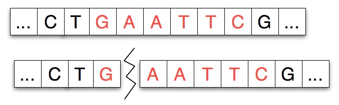
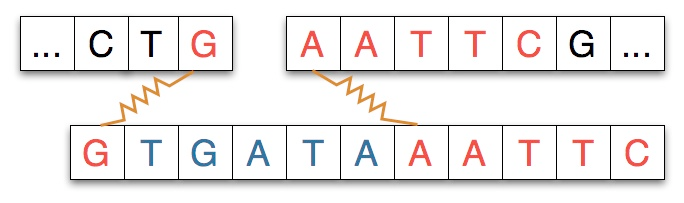
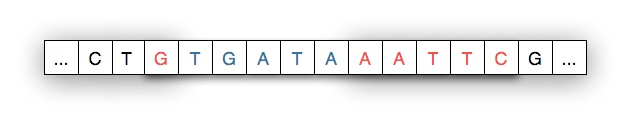

# Cutting and Splicing DNA

## Background

In this exercise, you will continue with the DNA implementation from the earlier exercise. We are providing you with an implementation for the tasks of the previous exercise _and_ for an additional operation. **But this implementation has some bugs that you will have to isolate and fix.**

**Start with the test cases provided.** You will find that three of the test cases fail.

- Why?
- How do you fix the implementation so that the test cases pass?

This exercise touches upon two important ideas in Java and other similar languages:

- class variables or static variables;
- equality.

You should read some relevant material before going further.

[**The `static` keyword in Java (CodeGuru)**](https://www.codeguru.com/java/tij/tij0037.shtml)

The reading material on `static` alone is insufficient to help you debug both problems. You will need to do some more investigation and exploration on your own ... but it should not be all that difficult.

## Cutting and Splicing DNA

The new operation that you will have to understand is a cut-and-splice operation. For this operation, you are given a sequence of codons (without junk) called a **restriction enzyme** and a **splice position**. You are also given a **splicee**, which is another enzyme (sequence of codons, no junk).

The cut-and-splice operation finds all occurrences of the restriction enzyme in a DNA sequence. Then, it splits the DNA sequence at the splice position, which is a position in the matching site for the restriction enzyme, and inserts the splicee at that position, and then stitches back the rest of the DNA sequence to the end of the splicee.

This operation **also** removes all junk in the DNA sequence. If the restriction enzyme is not present in a DNA sequence then this operation simply cleans the DNA sequence of all junk.

- **Examples of Cut-and-Splice**
    - The original DNA sequence is **ATCGGGAXTT**, the restriction enzyme is **GGGATT**, the splice position is 3, and the splicee is **CCATCT**: this cut-and-splice operation should produce a DNA strand with sequence **ATCGGGCCATCTATT**.
    - The original DNA sequence is **ATACTC**, the restriction enzyme is **CCC**, the splice position is 2, and the splicee is **CCATCT**: the restriction enzyme is not present in the original DNA sequence so we get a strand that is identical to the original.
    - The original DNA sequence is **ATCGGGAXTT**, the restriction enzyme is **ATC**, the splice position is 1, and the splicee is **CCATCT**: this cut-and-splice operation should produce a DNA strand with sequence **ACCATCTTCGGGATT**.

For this exercise, we have assumed that enzymes are codon sequences. This not strictly true. For a bit more detail about how restriction enzyme cleaving works, one can read the optional subsection below.

- **Restriction Enzyme Cleaving**

    Restriction enzymes cut a strand of DNA at a specific location, the *binding site*, typically separating the DNA strand into two pieces.

    Given a strand of DNA "*aatccgaattcgtatc*" and a restriction enzyme like EcoRI "*gaattc*", the restriction enzyme locates each occurrence of its pattern in the DNA strand and divides the strand into two pieces at that point, leaving either blunt or sticky ends.

    Restriction enzymes have two properties or features: the pattern of DNA that marks a site at which separation occurs and a number/index that indicates how many characters/nucleotides of the pattern attach to the left-part of the split strand. For example, the diagram below shows a strand split by EcoRI. The *pattern* for EcoRI is "gaattc" and the index of the split is one indicating that the first nucleotide/character of the restriction enzyme adheres to the left part of the split.

    

    In some experiments, and in our work, another strand of DNA will be spliced into the separated strand. The strand spliced in matches the separated strand at each end as shown in the diagram below where the spliced-in strand matches with G on the left and AATTC on the right as you view the strands.

    

    When the spliced-in strand joins the split strand we see a new, recombinant strand of DNA as shown below. The shaded areas indicate where the original strand was cleaved/cut by the restriction enzyme.

    

[Three scientists shared the Nobel Prize](http://nobelprize.org/nobel_prizes/medicine/laureates/1978/press.html) in 1978 for the discover of restriction enzymes. They are also an essential part of the process called [PCR *polymerase chain reaction*](http://en.wikipedia.org/wiki/Polymerase_chain_reaction) which is one of the most significant discoveries/inventions in chemistry and for which [Kary Mullis won the Nobel Prize in 1993.](http://nobelprize.org/nobel_prizes/chemistry/laureates/1993/press.html) Of significance to us in Vancouver, Mullis shared the Nobel Prize that year with Michael Smith, who was a Professor at UBC. Their work laid the foundation for genetic engineering.

You can see animations and explanations of both restriction enzymes and PCR at [DnaTube](http://www.dnatube.com/search_result.php?search_id=restriction) and [Cold Spring Harbor Dolan DNA Learning Center](http://www.dnalc.org/ddnalc/resources/restriction.html).
